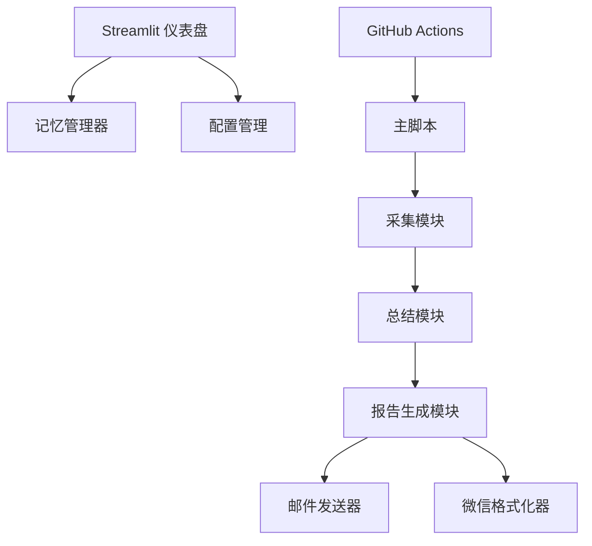

# 代码库概览：Daily AI News Agent

## 1. 代码库信息

**项目名称**: Daily AI News Agent (AI 每日新闻智能体)
**描述**: 一个自动化的 AI 新闻聚合器，负责抓取、总结并通过邮件和微信分发 AI 行业新闻。
**版本**: 2.4 (基于用户手册)
**主要语言**: Python
**框架**: Streamlit (仪表盘), OpenAI/DeepSeek (大语言模型), Jinja2 (模板引擎)

## 2. 架构

系统采用模块化架构，分为采集、处理和分发三个独立的组件。

### 核心模块

- **Fetcher (`src/fetcher.py`, `src/full_content_fetcher.py`)**: 从 RSS 源获取新闻列表，并使用 `beautifulsoup4` 和 `newspaper3k` 抓取正文内容。
- **Summarizer (`src/summarizer.py`)**: 使用 LLM (OpenAI/DeepSeek) 对文章进行总结，提取关键点并生成洞察。实现了“Token 节约”策略（先筛后读）。
- **Reporter (`src/reporter.py`)**: 使用 Jinja2 模板生成 HTML 和 Markdown 格式的报告。
- **EmailSender (`src/email_sender.py`)**: 通过 SMTP 或 Resend API 处理邮件分发。
- **Dashboard (`src/dashboard.py`)**: 提供基于 Streamlit 的 Web 界面，用于监控状态和手动控制。
- **MemoryManager (`src/memory_manager.py`)**: 管理历史记录和去重逻辑。

## 3. 组件列表

| 组件 | 文件路径 | 职责 |
| :--- | :--- | :--- |
| **主入口** | `src/main.py` | 编排整个工作流：抓取 -> 总结 -> 报告 -> 发送。 |
| **配置** | `src/config.py` | 管理配置项和环境变量。 |
| **深度调研** | `src/deep_research.py` | 针对特定主题进行深度搜索与分析（实验性功能）。 |
| **辅助脚本** | `scripts/*.py` | 用于 PDF 生成、软著材料准备和手动发邮件的脚本。 |

## 4. 接口

- **输入**: RSS 源列表 (`src/config.py` 中定义), 用户命令行参数 (CLI args)。
- **输出**:
    - HTML 邮件 (通过 SMTP/Resend 发送)
    - 微信公众号文章 (HTML 文件)
    - Streamlit 仪表盘 (Web UI)
    - PDF 文档 (软著申请材料)

## 5. 工作流

### 每日自动化工作流
1. **触发**: GitHub Action (`.github/workflows/daily_schedule.yml`) 在 UTC 00:00 (北京时间 08:00) 触发。
2. **抓取**: `NewsFetcher` 从配置的源中收集新闻（过去 24-48 小时）。
3. **过滤**: `Summarizer` 初筛无关文章以节省 Token。
4. **总结**: LLM 处理入选文章（Map-Reduce 模式）。
5. **生成**: `Reporter` 创建 HTML 报告。
6. **分发**: `EmailSender` 将报告发送给 `subscribers.txt` 中的订阅者。
7. **归档**: 报告保存到 `output/` 目录并提交回代码仓库。

## 6. 依赖项

- `openai`: LLM 交互
- `streamlit`: Web 仪表盘
- `feedparser`: RSS 解析
- `beautifulsoup4`: HTML 解析
- `jinja2`: 模板渲染
- `resend`: 邮件 API
- `reportlab`: PDF 生成

## 7. 审查备注

- **代码质量**: 模块化程度高，结构清晰。
- **文档**: 文档齐全（包含用户手册、软著信息、README）。
- **自动化**: 通过 GitHub Actions 实现了完全自动化。
- **改进空间**:
    - 移动端 App 集成 (计划中)。
    - 更健壮的网络请求错误处理。
    - 数据库集成 (目前仍使用 JSON/TXT 文件存储数据)。
